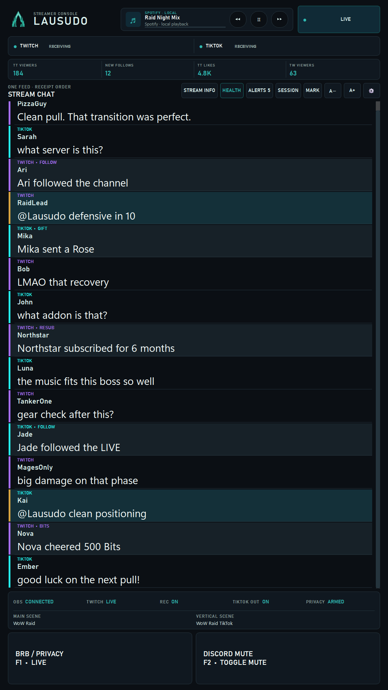
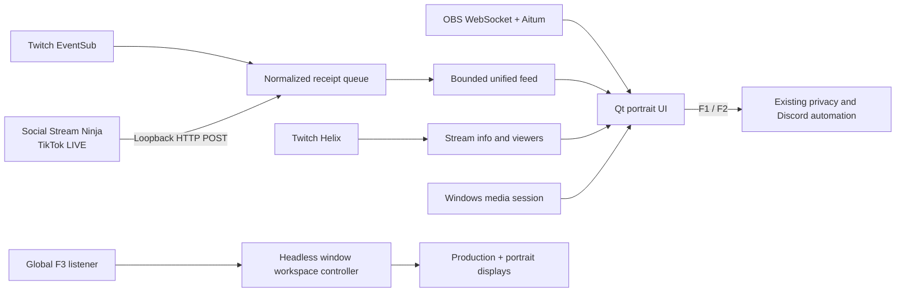

<p align="center">
  
</p>

<h1 align="center">Lausudo Streamer Console</h1>

<p align="center">
  A low-overhead Windows command center for one chronological Twitch + TikTok LIVE feed,
  OBS status, raid-safe stream controls, audience telemetry, and Spotify playback.
</p>

<p align="center">
  <a href="https://github.com/CRSD-Lau/Lausudo-Streamer-Console/actions/workflows/ci.yml"></a>
  
  
  
  
</p>

<p align="center">
  
</p>

## Why it exists

Streamer Console turns a portrait monitor into a readable stream companion while
leaving the game and production displays alone. It combines viewer conversation
in receipt order instead of stacking two unrelated chat windows, surfaces only
meaningful alerts, and keeps operational controls close without becoming a
second source of truth for OBS.

The application was built for the Lausudo Twitch + TikTok production stack. Its
integrations are intentionally narrow, inspectable, and local-first.

## Highlights

| Area | What it does |
| --- | --- |
| Unified feed | Merges Twitch and TikTok viewer chat in local receipt order with bounded retention, compact rows, highlighting, and manual scrollback. |
| Meaningful alerts | Shows named follows, subscriptions, resubs, gifts, raids, Bits, rewards, and TikTok shares while discarding generic platform noise. |
| Live pulse | Displays Twitch viewers plus best-effort TikTok viewers, new follows, and captured likes for the current stream session. |
| OBS awareness | Reads stream, recording, current main scene, Aitum vertical scene/output, microphone monitoring, Spotify monitoring, and BRB state. |
| Raid controls | Sends the same F1 BRB/privacy and F2 Discord-mute hotkeys as the existing canonical automation—no competing state machine. |
| F3 workspace | A separate startup listener opens only missing stream applications, arranges them across the approved three-monitor layout, and restores game focus without touching OBS or audio state. |
| Twitch Stream Info | Reads and updates the title/category through Twitch Helix using the public-client Device Code flow. |
| Spotify remote | Uses the local Windows media session for previous, play/pause, next, metadata, and progress without changing stream audio routing. |
| Windows-native shell | Supports native resizing, maximize, Windows 11 Snap Layouts, taskbar grouping, a branded icon, remembered portrait placement, and a short-window mode that gives chat and alerts priority when Discord shares the display. |

## Architecture



The workers are isolated: losing OBS does not stop chat, and losing one chat
source does not stop the other. See [Architecture](docs/ARCHITECTURE.md) for the
ordering, resilience, and trust-boundary details.

## Quick start

### Requirements

- Windows 10 or 11
- Python 3.11 or 3.13
- OBS Studio with OBS WebSocket enabled on loopback
- Aitum Stream Suite when vertical canvas status is required
- Official [Social Stream Ninja](https://socialstream.ninja/) extension for TikTok collection
- Spotify desktop app for the local media controls
- AutoHotkey v2 plus the existing `PrivacyToggle.ahk` helper when the BRB and
  Discord buttons are used; Streamer Console starts and stops its managed copy

### Install

```powershell
git clone https://github.com/CRSD-Lau/Lausudo-Streamer-Console.git
Set-Location -LiteralPath '.\Lausudo-Streamer-Console'
py -3.13 -m pip install -r .\requirements.txt
```

Configure Social Stream Ninja to POST to:

```text
http://127.0.0.1:17840/ingest/socialstream
```

Then launch:

```powershell
.\Start-StreamerConsole.ps1
```

Install or repair the branded Start-menu/taskbar shortcut with:

```powershell
.\Install-StreamerConsoleShortcut.ps1
```

The scripts resolve the repository directory dynamically; they do not require a
fixed clone path. See [Installation](docs/INSTALLATION.md),
[Configuration](docs/CONFIGURATION.md), and
[Social Stream Ninja setup](docs/SOCIAL_STREAM_SETUP.md) for the complete flow.

Install the optional global **F3 Prepare Stream Workspace** listener with:

```powershell
.\tools\stream_workspace\Install-StreamWorkspace.ps1
```

F3 reuses existing windows, launches only missing approved desktop applications,
and is safe to press repeatedly. It leaves the configured Social Stream Ninja
browser context untouched and lets elevated TikTok LIVE Studio restore its saved
window position. It never starts or stops a stream, recording, Virtual Camera,
scene, microphone, Discord mute state, or Voicemeeter route. See
[Installation](docs/INSTALLATION.md#global-f3-stream-workspace) for the exact
default layout and rollback command.

## Twitch authorization

The optional official Twitch connection uses the Device Code Grant for a public
desktop client. It needs a Twitch application **Client ID**, but never a client
secret or OAuth redirect URL. Authorization is completed through the Twitch
verification page and saved for the current Windows user in Windows Credential
Manager. Twitch access tokens refresh automatically, so approval is normally a
one-time step. Existing DPAPI-encrypted token files remain supported as a legacy
fallback.

The connection enables native Twitch chat, complete supported EventSub alerts,
viewer counts, stream markers, and title/category updates. TikTok collection
continues independently through Social Stream Ninja.

## Privacy and security

- The Social Stream receiver binds only to `127.0.0.1`, caps request bodies,
  validates JSON, and never logs request bodies or headers.
- OBS credentials are read from OBS's local configuration only in memory and are
  never copied into Streamer Console configuration.
- Twitch access and refresh tokens are protected by Windows Credential Manager
  for the current user and are never included in ordinary configuration or logs.
- Logs are bounded and redact credential-shaped fields. Chat text, cookies,
  passwords, stream keys, tokens, and Social Stream session IDs are not logged.
- Session files contain aggregate counts and marker metadata, not viewer chat.
- There is no analytics, crash-reporting service, advertising, or application
  telemetry.
- Documentation screenshots are rendered off-screen with simulated messages;
  no live desktop, viewer chat, OBS password, or account session is captured.

Read [Security policy](SECURITY.md), [Privacy](PRIVACY.md), and the security
sections of [Architecture](docs/ARCHITECTURE.md) before changing an integration.

## Controls and deployment assumptions

The BRB and Discord buttons deliberately depend on the existing external F1/F2
automation and do not include that personal controller in this repository. The
button states remain evidence-based: BRB comes from actual OBS/Aitum state, and
Discord mute is presented as a toggle because Discord exposes no supported local
mute-state API in this deployment.

Default OBS source and scene names (`Mic/Aux`, `Spotify`, `BRB - Main`, and
`BRB - Vertical`) are configurable. The recovery links and visual branding are
Lausudo-specific by design.

## Development

```powershell
py -3.13 -m unittest discover -s tests -v
py -3.13 .\tools\render_previews.py
```

Tests use Qt's off-screen platform and mocked network/input boundaries. They do
not send global hotkeys, post production chat, or control OBS. See
[Development](docs/DEVELOPMENT.md) and [Contributing](CONTRIBUTING.md).

## Documentation

- [Installation](docs/INSTALLATION.md)
- [Configuration reference](docs/CONFIGURATION.md)
- [Architecture](docs/ARCHITECTURE.md)
- [Social Stream Ninja setup](docs/SOCIAL_STREAM_SETUP.md)
- [Troubleshooting](docs/TROUBLESHOOTING.md)
- [Development](docs/DEVELOPMENT.md)
- [Architecture decision: native Qt and local integrations](docs/adr/0001-native-qt-and-local-integrations.md)
- [Privacy](PRIVACY.md)
- [Security policy](SECURITY.md)
- [Support](SUPPORT.md)
- [Code of conduct](CODE_OF_CONDUCT.md)
- [Changelog](CHANGELOG.md)
- [Third-party notices](THIRD_PARTY_NOTICES.md)
- [Uninstall](docs/UNINSTALL.md)

## Project status and legal notice

Version 1.1.0 reflects the current Lausudo production workflow. TikTok data is
best effort because it depends on the browser LIVE page and Social Stream Ninja;
platform changes, login gates, CAPTCHA, and throttling can affect collection.

No license is granted by this repository. The source is publicly visible for
transparency and collaboration, but all rights are reserved unless the owner
provides written permission. Third-party dependencies retain their own licenses.

Twitch, TikTok, Discord, Spotify, OBS, Aitum, Social Stream Ninja, Windows, and
World of Warcraft are trademarks or projects of their respective owners. This
project is independent and is not endorsed by them.
